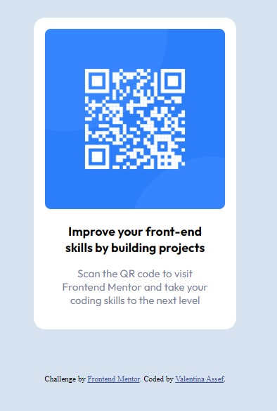

## FrontendMentor-Challenges
Desafios de Front End

# Qr Code Component

### Screenshot

### Visita el sitio en  https://valentina-assef.github.io/Challenge-qr-code/

Se requeria realizar una copia exacta de un codigo QR.
Se utilizo para su resolucion HTML, CSS y Flexbox.

### Desarrollado con:

- HTML5
- CSS
- Flexbox
